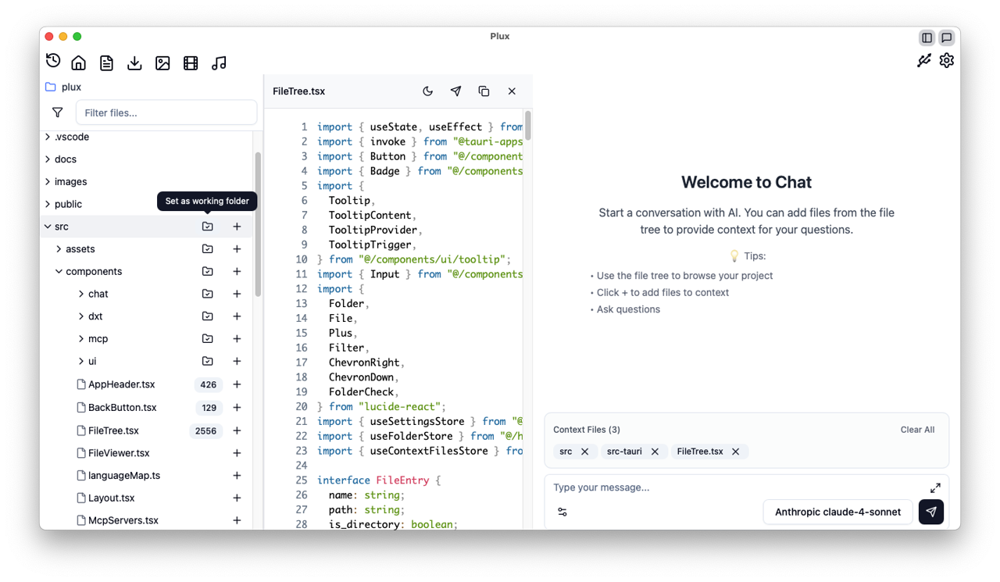

# plux

🎯 **One-click + your files to AI.**

**Plux** is a powerful desktop app that turns your local files — PDFs, CSVs, source code, anything — into real-time AI context with just one click. Ask questions, get summaries, understand your projects faster than ever.

Built with **React**, **TypeScript**, **Tauri**, and the **Model Context Protocol (MCP)**, Plux lets you work with your favorite models like Claude, GPT, and Gemini — locally or in the cloud.

## Screenshot

## Features

* 🔍 **Smart File Explorer**: Browse files and instantly preview them in-app
* ➕ **One-Click Context**: Add any file to the AI conversation with a single click
* 💬 **Multi-Model AI Chat**: Switch between Claude, GPT, Gemini, or your own model via MCP
* 📊 **Supports PDFs, CSVs, Code, Markdown**: AI understands your files natively
* 🌐 **MCP Integration**: Connect with pluggable model servers using Model Context Protocol
* 🎨 **Syntax-Highlighted Viewer**: Code files beautifully rendered for reading and AI use
* ⚡️ **Fast, Local, Private**: Powered by Tauri, your data stays on your machine

## Example

* Click on `data.csv` → AI shows a preview and lets you ask: “What's the average sales per region?”
* Open `main.rs` → Ask: “What does this function do?”
* Click on `report.pdf` → Ask: “Summarize the key findings for me.”

You don't copy-paste. You don't switch tabs. You just click + and ask.

## Getting Started

### Prerequisites and installation

development or CONTRIBUTING

[development](CONTRIBUTING.md)

## Usage

1. **Navigate to Chat**: The app starts with the chat interface
2. **Browse Files**: Use the file tree on the left to explore your project
3. **Add Context**: Click the + button next to any file or folder to add it to your chat context
4. **Chat with AI**: Ask questions about your project - the AI will have access to the files you've added

## Get Involved

Plux is open-source and evolving fast. Star the repo ⭐, try it out, or build your own plugin.

We’re building the future of local-first, AI-powered development tools — and you’re invited.
